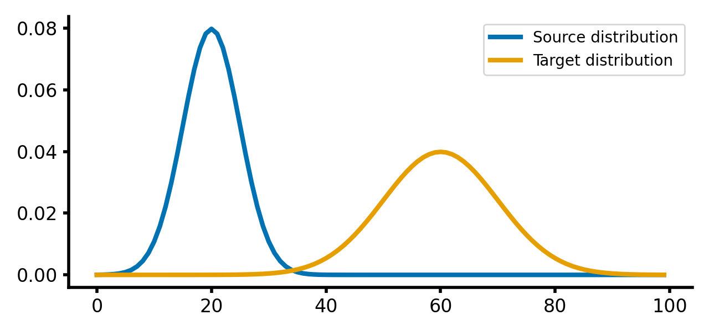
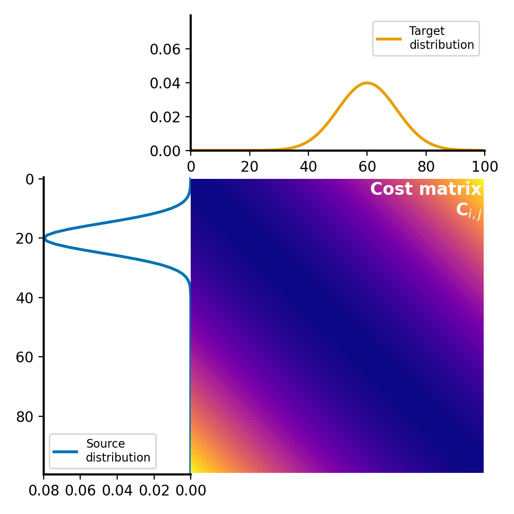
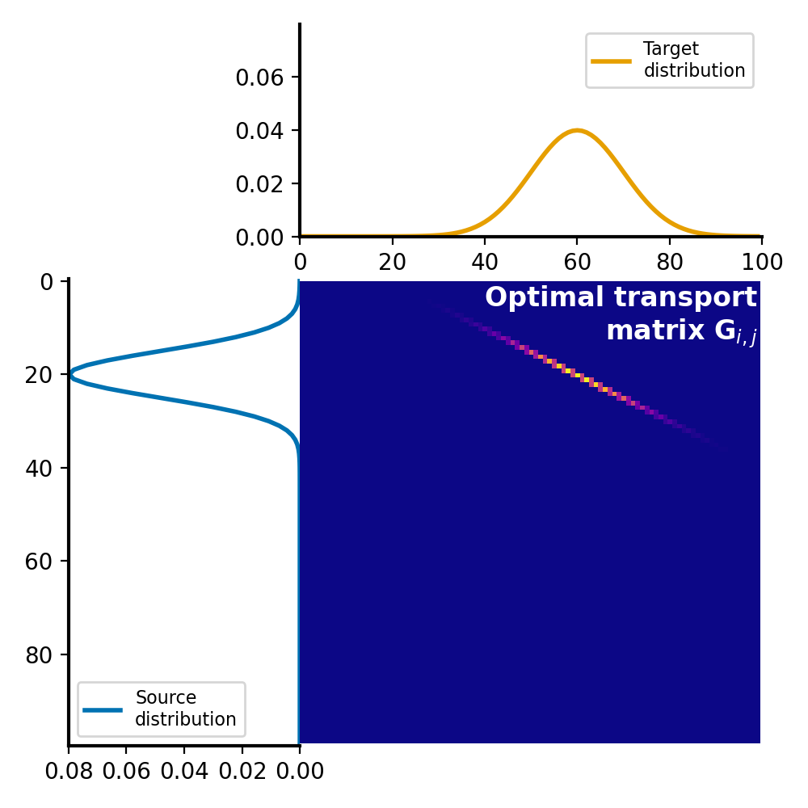

# Wasserstein metric

This repository contains the code for the blog posts on 

* [Wasserstein distance and optimal transport](https://www.fabriziomusacchio.com/blog/2023-07-22-wasserstein_distance). 
* [Calculating the Wasserstein distance by entropy regularization (Sinkhorn algorithm)](https://www.fabriziomusacchio.com/blog/2023-07-23-wasserstein_distance_skinhorn)

For further details, please refer to this post.

For reproducibility:

```powershell
conda create -n wasserstein -y python=3.9
conda activate wasserstein
conda install mamba -y
mamba install -y numpy matplotlib scikit-learn scipy pot ipykernel
pip install POT
```


## Example
Two example distributions (source and target):



The according distance (cost) matrix:



And the resulting optimal transport plan:



The corresponding Wasserstein distance is $W_1 = \sim0.1658$.

