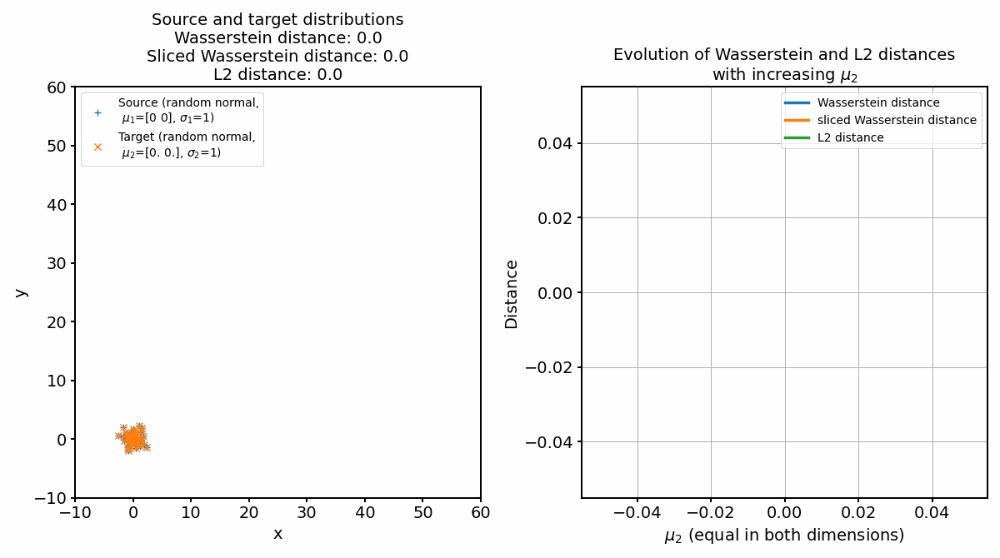
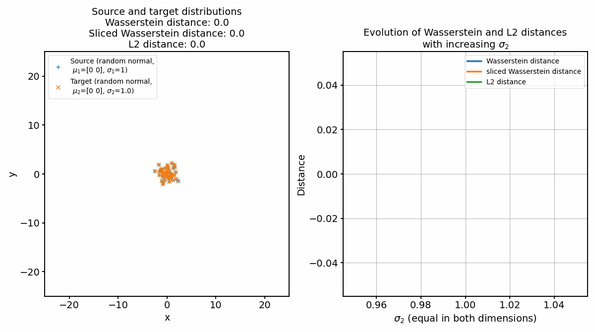

# Wasserstein metric

This repository contains the code for the blog posts on 

* [Wasserstein distance and optimal transport](https://www.fabriziomusacchio.com/blog/2023-07-22-wasserstein_distance)
* [Wasserstein distance via entropy regularization (Sinkhorn algorithm)](https://www.fabriziomusacchio.com/blog/2023-07-23-wasserstein_distance_skinhorn)
* [Approximating the Wasserstein distance with cumulative distribution functions ](https://www.fabriziomusacchio.com/blog/2023-07-24-wasserstein_distance_cdf_approximation/)
* [Comparing Wasserstein distance, sliced Wasserstein distance, and L2 norm ](https://www.fabriziomusacchio.com/blog/2023-07-26-wasserstein_vs_l2_norm/)
* [Probability distance metrics in machine learning](https://www.fabriziomusacchio.com/blog/2023-07-28-probability_density_metrics/)

For further details, please refer to this post.

For reproducibility:

```powershell
conda create -n wasserstein -y python=3.9
conda activate wasserstein
conda install mamba -y
mamba install -y numpy matplotlib scikit-learn scipy pot ipykernel
pip install POT
```


## Examples
Two example distributions (source and target):


The according distance (cost) matrix:


And the resulting optimal transport plan:


The corresponding Wasserstein distance is $W_1 = \sim0.1658$.

Comparing Wasserstein distance, sliced Wasserstein distance (SWD), and L2 norm:




Comparing various probability distance metrics:


